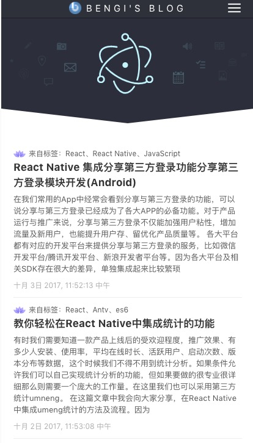
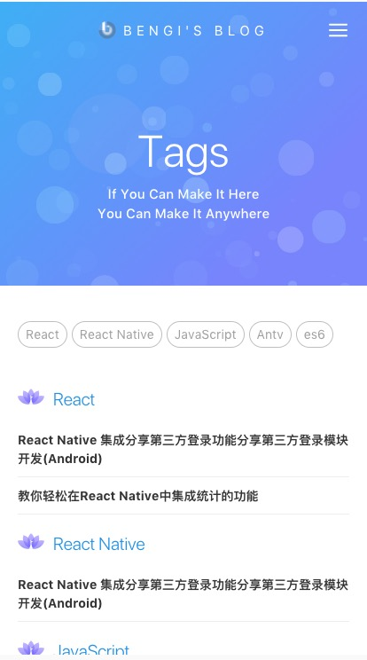
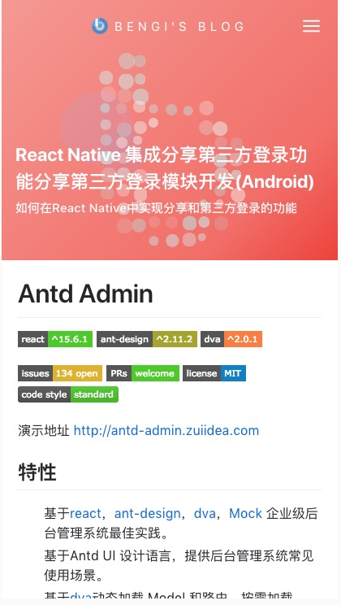

# bengi's blog


[](https://github.com/facebook/react)
[](https://github.com/ant-design/ant-design)
[](https://github.com/dvajs/dva)

[](http://opensource.org/licenses/MIT)
[](http://standardjs.com)

演示地址 <http://xh.jblog.info:3000>

## 特性

-   基于[react](https://github.com/facebook/react)，[ant-design](https://github.com/ant-design/ant-design)，[dva](https://github.com/dvajs/dva)个人博客实践。
-   使用[ant-motion](https://github.com/ant-design/ant-motion)动效logo, 将svg图片转换成动态小球。
-   使用[roadhog](https://github.com/sorrycc/roadhog)本地调试和构建，其中Mock功能实现脱离后端独立开发。
-   响应式设计。

### 一、前言 
***
个人博客站点的第一版，[dva](https://github.com/dvajs/dva) + [ant-design](https://github.com/ant-design/ant-design) 的组合已经用过很多次了，每一次使用都能够学到一些新的东西，
发现自己越来越喜欢React这个框架了。这次借着十一放假，用五天的时候搭建了一个博客，顺便能够激发自己写博客的动力。嘻嘻..

这也是自己第一次写README，上面参考[dva](https://github.com/dvajs/dva) 写了，感觉怪变扭的。

感谢 [Electron](https://github.com/electron/electron) 给了我很多界面上的灵感！ 
> — 我就喜欢扒样式

另外这是第一次坚持使用 [eslint](https://github.com/eslint/eslint) 写完整个项目， 瞬间感觉自己代码风格棒棒的：）
### 二、仓库地址: [bengiBlog](https://github.com/w771854332/bengiBlog)
***
> 项目运行步骤 （推荐使用 **[yarn](https://github.com/yarnpkg/yarn)** 进行安装 也可使用 **[npm](https://github.com/npm/npm)** ）
```bash
 git clone https://github.com/w771854332/bengiBlog.git
```
```bash
 yarn
```
```bash
 yarn start
```

项目默认使用 **proxy**，将 .roadhogrc.js 中的 proxy注掉 可使用 mock 模拟数据

### 三、技术说明
***
-   使用 enquire 和 github-markdown-css 配合 node端 marked 模块解析 .md 文件
-   在 localstorage 中缓存文章，达到最快的加载速度

### 四、项目心得
***
> 立下一个flag，激励自己每次都写心得

1.  目录结构 使用 王福朋老师教的 **container + component + model + services**，
组件单独用文件进行管理，包含 index.js 和 style.less 
2.  把 state 集中管理，把大部分状态都存入 store 中，这样可以方便做本地管理
3.  使用es7的 **async/await** 处理fetch, 统一做错误处理

### 五、截图
***
|首页|标签页|文章页|
|:--:|:--:|:--:|
|||
